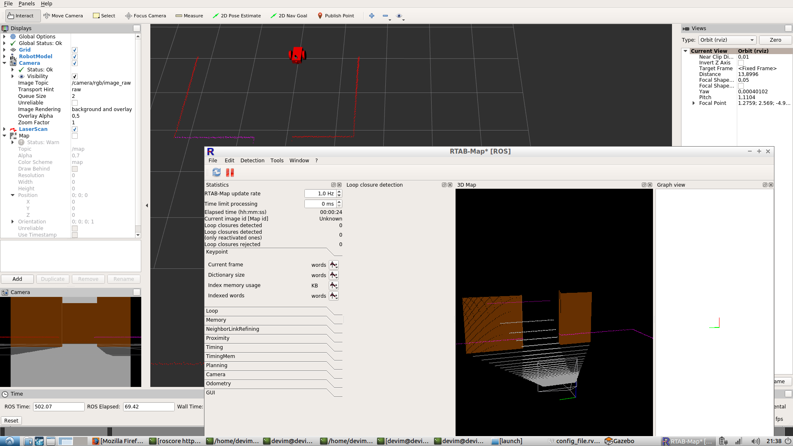

# Map My World
This project is the fourth project that comes in **Localization** lesson in Robotics Software Engineer Nanodegree Program. This project is built upon the third project which has a 3D world and robot. In this project, the robot can be controlled by keyboard and RTAB-MAP system is used for contructing map.

### Directory Structure
```
    .WhereAmI                          
    ├── my_robot                       # main project file that includes launch files  
    ├── teleop_twist_keyboard          # for controlling by keyboard   
    ├── CMakeLists.txt                   
    └── SS_Mapping.png                 # screenshot from the project
```

### Steps to launch the simulation

#### Step 1 | Create a catkin workspace
```sh
$ mkdir -p catkin_ws/src
$ cd catkin_ws/src
$ catkin_init_workspace
$ cd ..
$ catkin_make
```

#### Step 2 | Clone the repository
```sh
$ cd catkin/src
$ git clone https://github.com/CetinFurkan/ROS_MapMyWorld.git  
$ cd ..
$ catkin_make
```

#### Step 3 | Source the workspace  
```sh
$ source devel/setup.bash
```

#### Step 4 | Launch the simulation (each in seperated console)
```sh
$ roslaunch my_robot world.launch 
$ roslaunch my_robot mapping.launch
$ rosrun teleop_twist_keyboard teleop_twist_keyboard.py
```
